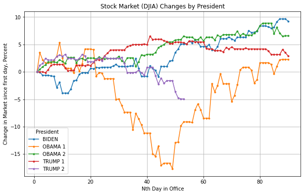

## DJIA Demo

### Purpose

Use window functions to demonstrate the relative performance
of the stock market (DJIA) of the last few presidential terms.

## Startup

```bash
make serve
```

Connect to the following: `postgresql://localhost:5432/postgres`

### Automation
To just generate the automated output, assuming running on a Linux or MacOS machine:

```bash
make run
# Wait a few seconds
pip install pandas matplotlib
python3 plots/djia-days-in-office.py
```



This will produce the following image :

## License Notice

S&P Dow Jones Indices LLC, Dow Jones Industrial Average (DJIA),
retrieved from FRED, Federal Reserve Bank of St. Louis;
https://fred.stlouisfed.org/series/DJIA, March 11, 2025.