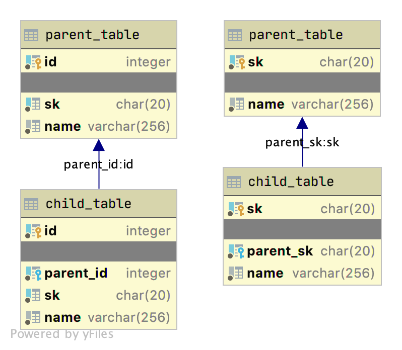

## String Key Demo

To start this demo, type `make run`.

### Comparison



The following queries should proce the same rows:

| name | sk |
| :--- | :--- |
| 94A612C5C6405146C4A1B26E4913C241286A926985211B41FE | C8D3E0C59486DEEBCD33 |
| E07CB79DC862840077E1D00DEA3CBEAD0DD1534961CF58DDC9 | C8D3E0C59486DEEBCD33 |
| 4251E26A0EA38F98456A11912E08AAE9461C0B49E95AF854A8 | C8D3E0C59486DEEBCD33 |
| B2E1DB58FF46FB69092702B290F83E315EA682BF895C6B817C | C8D3E0C59486DEEBCD33 |


#### Integer Keys

```postgresql
SELECT ct.name, pt.sk
FROM intkeys.parent_table pt
     JOIN intkeys.child_table ct ON pt.id = ct.parent_id
WHERE pt.sk = '832126C27B70CE64D53A';
```

Plan:
```
Nested Loop  (cost=4.61..31.45 rows=5 width=72) (actual time=0.519..0.744 rows=4 loops=1)
  ->  Index Scan using parent_table_sk_index on parent_table pt  (cost=0.29..8.30 rows=1 width=25) (actual time=0.084..0.102 rows=1 loops=1)
        Index Cond: (sk = 'C8D3E0C59486DEEBCD33'::bpchar)
  ->  Bitmap Heap Scan on child_table ct  (cost=4.33..23.09 rows=5 width=55) (actual time=0.124..0.255 rows=4 loops=1)
        Recheck Cond: (parent_id = pt.id)
        Heap Blocks: exact=4
        ->  Bitmap Index Scan on child_table_parent_id_index  (cost=0.00..4.33 rows=5 width=0) (actual time=0.058..0.066 rows=4 loops=1)
              Index Cond: (parent_id = pt.id)
Planning Time: 1.203 ms
Execution Time: 1.023 ms
```

#### String Keys

```postgresql
SELECT ct.name, pt.sk
FROM stringkeys.parent_table pt
     JOIN stringkeys.child_table ct ON pt.sk = ct.parent_sk
WHERE pt.sk = '832126C27B70CE64D53A';
```

```
Nested Loop  (cost=4.74..27.66 rows=5 width=51) (actual time=0.215..0.334 rows=4 loops=1)
  ->  Index Only Scan using parent_table_sk_index on parent_table pt  (cost=0.29..4.30 rows=1 width=21) (actual time=0.143..0.159 rows=1 loops=1)
        Index Cond: (sk = 'C8D3E0C59486DEEBCD33'::bpchar)
        Heap Fetches: 0
  ->  Bitmap Heap Scan on child_table ct  (cost=4.45..23.31 rows=5 width=72) (actual time=0.043..0.086 rows=4 loops=1)
        Recheck Cond: (parent_sk = 'C8D3E0C59486DEEBCD33'::bpchar)
        Heap Blocks: exact=4
        ->  Bitmap Index Scan on child_table_parent_id_index  (cost=0.00..4.45 rows=5 width=0) (actual time=0.020..0.027 rows=4 loops=1)
              Index Cond: (parent_sk = 'C8D3E0C59486DEEBCD33'::bpchar)
Planning Time: 0.161 ms
Execution Time: 0.493 ms
```

#### Size Comparison (kb)

| table\_schema | table\_name | total | index | table |
| :--- | :--- | :--- | :--- | :--- |
| intkeys | parent\_table | 1,904 | 800 | 1.104 |
| intkeys | child\_table | 10,264 | 4,896 | 5,368 |
| intkeys | total        | 12,168 | 5,696 | 6,472 |

| table\_schema | table\_name | total | index | table |
| :--- | :--- | :--- | :--- | :--- |
| stringkeys | parent\_table | 1,584 | 560 | 1,024 |
| stringkeys | child\_table | 11,152 | 4,960 | 6,192 |
| stringkeys | total        | 12,736 | 5,520 | 7,216 |